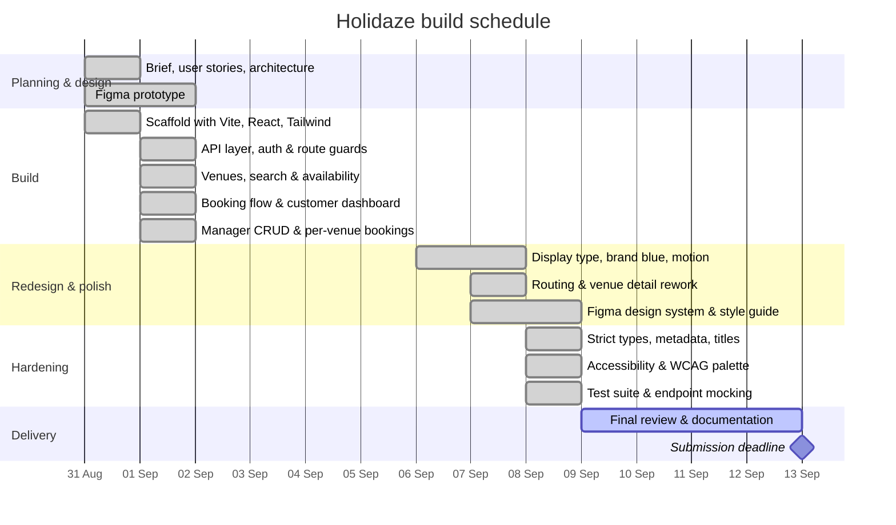

# Holidaze — project timeline

Gantt chart for the Holidaze build. The exam window ran from **31 August 2026, 08:00**
to **13 September 2026, 23:59**; the dates below are taken from this repository's commit
history.

## Phases

| Dates    | Phase              | What was done                                                                                                                                                                                                              |
| -------- | ------------------ | -------------------------------------------------------------------------------------------------------------------------------------------------------------------------------------------------------------------------- |
| 31 Aug   | Planning & design  | Read the brief, wrote the user stories against the Holidaze API, planned the route and data architecture, and built the design prototype in Figma.                                                                         |
| 31 Aug   | Project scaffold   | Vite + React + TypeScript + Tailwind, linting, the routing shell, and an early Netlify deploy to prove the pipeline.                                                                                                       |
| 1 Sep    | Core features      | Typed API client, auth with route guards, venue browsing with search and an availability calendar, the booking flow with dashboards, and manager CRUD.                                                                     |
| 6–7 Sep  | Redesign & polish  | A display typeface and the accent palette, the interface reworked around the logo's blue with motion, venue browsing moved to its own route, and the venue detail page rebuilt around a booking panel.                     |
| 7–8 Sep  | Design deliverable | The as-built design system in Figma — variables, text and effect styles, 22 component sets, and desktop and mobile screens — which doubles as the style guide.                                                             |
| 8 Sep    | Hardening          | Strict type checking, per-route page titles and metadata, an accessibility pass (dialog semantics, skip link, heading levels, WCAG AA palette), the test suite with every endpoint mocked, and route-level code splitting. |
| 9–13 Sep | Delivery           | Final review, documentation, and submission.                                                                                                                                                                               |

## Deliverables

| Item             | Link                                                                                        |
| ---------------- | ------------------------------------------------------------------------------------------- |
| Live demo        | https://holidazev1.netlify.app                                                              |
| Repository       | https://github.com/AndrewMoisa/holidaze                                                     |
| Design prototype | https://www.figma.com/design/UNtZNUo3tTC14FgS27KsSB/Holidaze-%E2%80%94-As-Built?node-id=1-3 |
| Style guide      | https://www.figma.com/design/UNtZNUo3tTC14FgS27KsSB/Holidaze-%E2%80%94-As-Built?node-id=8-2 |
| Kanban board     | https://github.com/users/AndrewMoisa/projects/3                                             |
